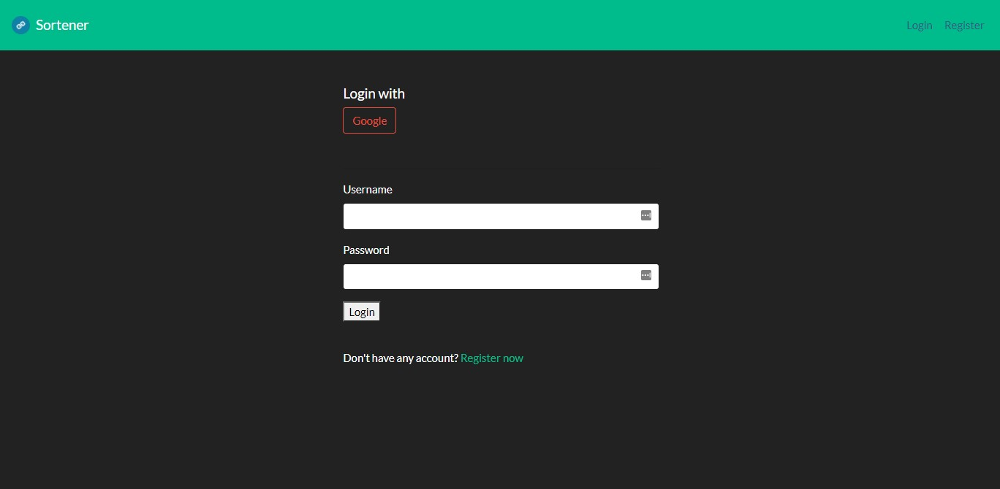
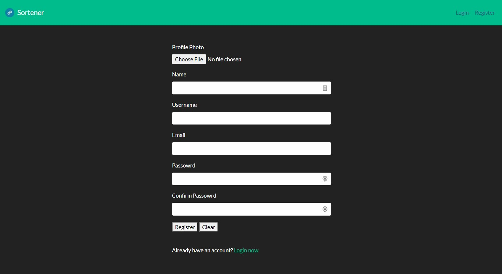
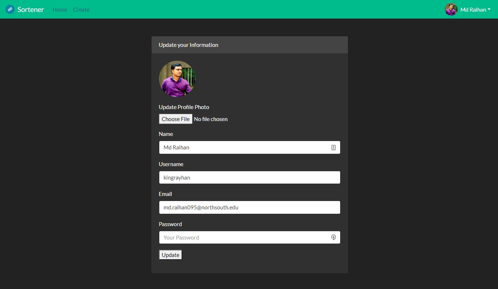
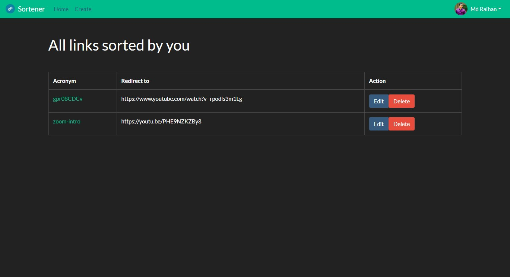
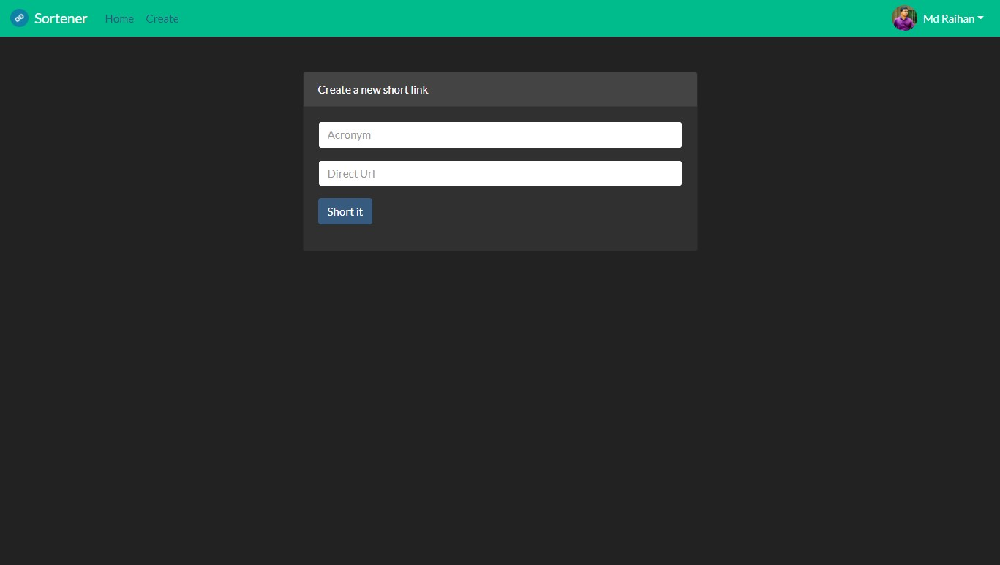

# Nodejs Shortener

### 🌎 → https://node-shortener.herokuapp.com

This is a URL shortener that takes a long URL and turns it into whatever URL you would like it to be.

### Tools used on this project

- Backend: [Express.js](https://expressjs.com/)
- Template Engine: [Handlebar](https://www.npmjs.com/package/express-handlebars)
- Database: [Mongodb](https://www.mongodb.com/)
- Database ORM: [Mongoose](https://mongoosejs.com/)
- File-uploader: [Express fileupload](https://www.npmjs.com/package/express-fileupload)
- Authenticator: [Passport.js](https://github.com/jaredhanson/passport)

### Screenshots

